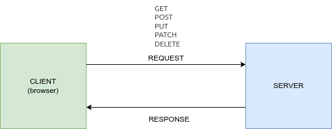
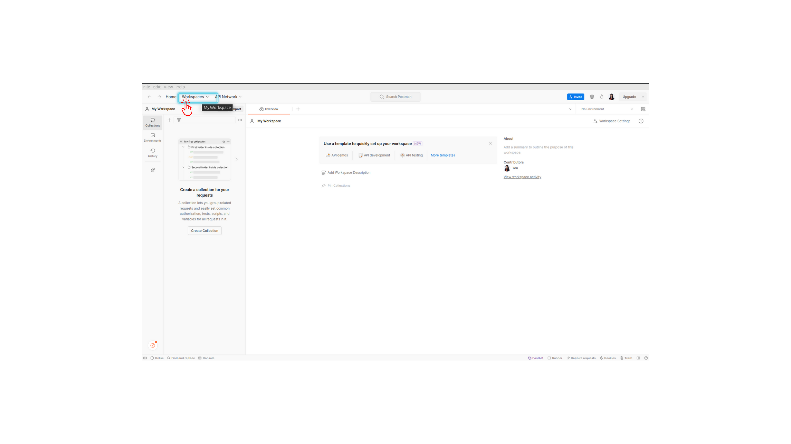
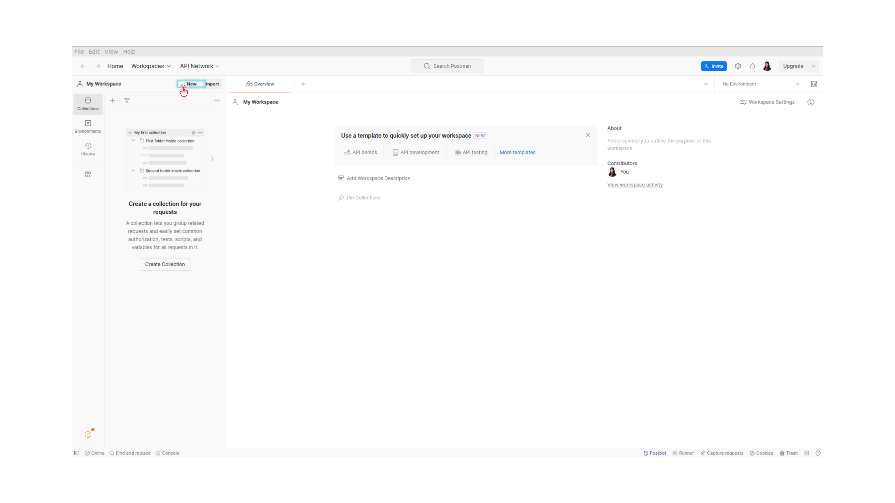
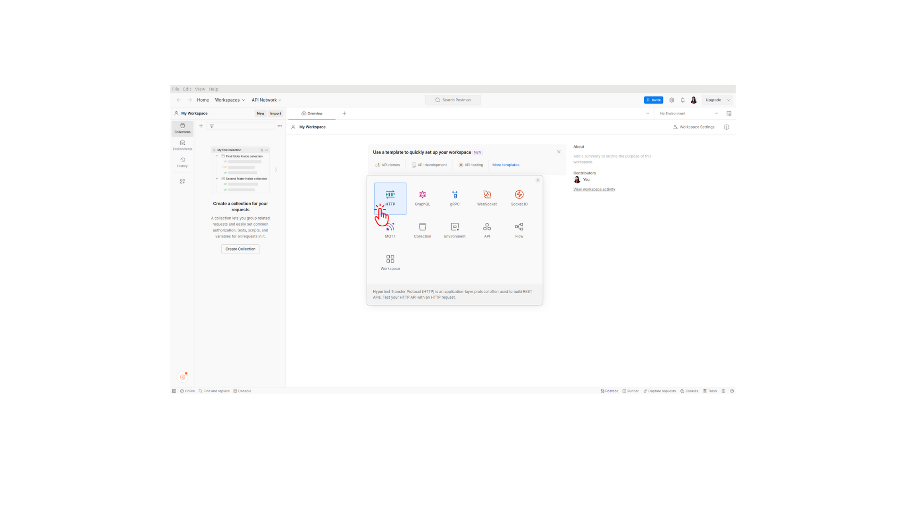
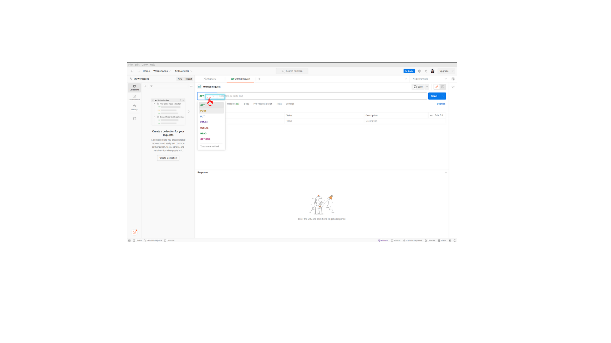

# Crash Course on building a REST API using Gin Library

## Introduction to RESTful API
REST (Representational State Transfer) API is a standard for communication between systems over the internet. It uses HTTP requests to perform CRUD (Create, Read, Update, Delete) operations on resources. _too much right?_

Hey everyone, welcome back to my GitHub! In this tutorial, we're exploring how to build a REST API using Go. If you're not familiar with what a REST API is, don't worry, I'll break it down for you, SIMPLY!

In the web world, there are two main parts: the client and the server. When you visit a website, your browser (the client) sends a request to the server to get some information. The server processes this request and sends back the data. Then, your browser displays that data.



For example, let's say you're using a website to manage your to-do list. When you want to SEE all your tasks, in this case, your browser sends a "GET" request to the server, asking for listing your to-dos. Then the server responds with a list of your tasks in a format called JSON.

If you want to ADD a new task, your browser sends a "POST" request to the same URL, along with the details of the new task in a JSON format (in this tutorial, we will do this via Postman API). The server then adds this task to your list and sends back a confirmation.

So, in short, a RESTful API allows clients (like your browser) to communicate with servers using standard HTTP methods (like GET and POST) and exchange data in JSON format. And that's the basics of it! Let's get into building our REST API now.

## Pre-requisites
- Familiar with Basic Go Syntax.

## Setting Up Your Go Application
1. Install Visual Studio Code or GoLand IDE for Go development.
2. If you are using VSC 
    a. Install Go extension in Visual Studio Code for Go-specific functionalities.
3. Initialize Go and run `go mod tidy` to ensure proper package management.
---

To set up our Go application for building our REST API, we first create a directory named "Using gin Library" and inside it, a file named "main.go" with the package declaration.Then, we install the "gin" library, which we'll use for our REST API, by initializing dependency tracking with running `go mod init using-gin-library` in the terminal of your code editor and then fetching the "gin" package with `go get github.com/gin-gonic/gin`.

Doing this will automatically create two files in your current directory, that is `go.sum` and `go.mod`. These also includes information regarding your dependencies.

With our dependencies set up, we can define our `to-do` data structure using a struct, including fields for id (string), item (string), and completed (boolean). Then, we create a slice of to-dos and populate it with some sample data.

```
type todo struct {
	ID        string
	Item      string
	Completed bool
}
```

To ensure our struct can be encoded to and decoded from JSON, we add struct tags specifying the JSON property names.

```
type todo struct {
	ID        string `json: "id"`
	Item      string `json: "item"`
	Completed bool   `json: "completed"`
}
```

By importing necessary packages (`net/http` and `github.com/gin-gonic/gin`), we proceed to create the main function.

```
package main

import (
	"github.com/gin-gonic/gin"
	"net/http"
)
```

We then initialize the Gin router with `gin.Default()` in main function

```

func main() {
	router := gin.Default()
    router.Run("localhost:9090")
}
```

Here's the breakdown of what we did uptill now:

1. **Setting up the directory and file structure**: Create a directory named "using gin Library" and a file named "main.go" inside it, with the `package main` declaration.

2. **Installing dependencies**: Open a terminal and execute `go mod init example/todo-go` to initialize dependency tracking. Then, fetch the "gin" package with `go get github.com/gin-gonic/gin`.

3. **Defining the to-do data structure**: Define a struct named "todo" with fields for id (string), item (string), and completed (boolean). Create a slice of to-dos and populate it with sample data.

4. **JSON encoding and decoding**: Add struct tags specifying the JSON property names for encoding and decoding.

5. **Importing packages**: Import the necessary packages `net/http` and `github.com/gin-gonic/gin`.

6. **Creating the server**: In the main function, initialize the Gin router with `gin.Default()` and start the server with `router.Run(":9090")`.

This ONLY sets up our Go application to build a REST API using the Gin framework.

---
## Understanding the Code
We'll go through each part of the code step by step.

### 1. GET Request
- Endpoint: `/list`
- Function: `getTodos`
- Description: Retrieves a list of todos.
- HTTP Method: GET
- Response: Returns a JSON array of todo items.

### 2. POST Request
- Endpoint: `/add`
- Function: `addTodos`
- Description: Adds a new todo item to the list.
- HTTP Method: POST
- Request Body: JSON object with fields `ID`, `Item`, and `Completed`.
- Response: Returns the newly added todo item as JSON.

### 3. GET Request (by ID)
- Endpoint: `/list/:id`
- Function: `getTodoByID`
- Description: Retrieves a todo item by its ID.
- HTTP Method: GET
- Path Parameter: `id` (ID of the todo item)
- Response: Returns the todo item with the specified ID as JSON.

### 4. PATCH Request
- Endpoint: `/update/:id`
- Function: `updateTodoByID`
- Description: Updates a todo item by its ID.
- HTTP Method: PATCH
- Path Parameter: `id` (ID of the todo item)
- Request Body: JSON object with fields to update.
- Response: Returns the updated todo item as JSON.

### 5. DELETE Request
- Endpoint: `/delete/:id`
- Function: `deleteTodoByID`
- Description: Deletes a todo item by its ID.
- HTTP Method: DELETE
- Path Parameter: `id` (ID of the todo item)
- Response: Returns a success message if the todo item is deleted.

## Running the Go REST API
1. Use `go run main.go` command to run the application.
2. Use `go build` to build the executable binary.
3. I used Postman to send requests to the API endpoints for testing and interaction.

Here's how you can use this REST API -

1. Get the Postman app - You can install it from [here](https://www.postman.com/downloads/) and Sign in
2. Select Workspaces and My workspace
    
3. Select New
    
4. Select HTTP Request
    
5. Here you can see all the Requests that we want to play with for our REST API application
    

By following these steps, you can understand and work with REST API using the Gin library in Go. Happy coding!
